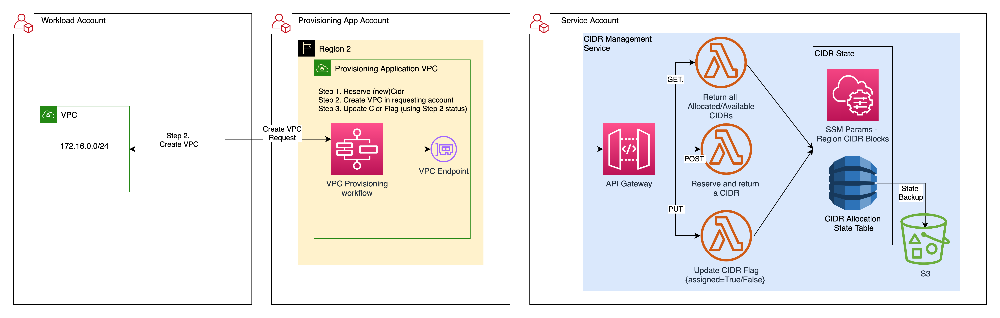

# Centralized CIDR Management API deployed with SAM CLI

## Features of the API 
* This API is used to manage the CIDR allocation to VPCs in a multi-account, multi-region environment. 
* The API is consumed before provisioning a VPC to allocate a non-overlapping CIDR block to the VPC. It provides a non-overlapping CIDR block of the requested size in the requested region. 
* The API uses DynamoDB locks to handle concurrent requests, ensuring concurrent requests are not allocated same or overlapping CIDRs.

## Product Versions
* AWS SAM CLI - used for local development, build, package and deploy the API 
* Python Behave 1.2.6 BDD framework - Integration tests to validate the API deployment
* AWS SDK for Python (Boto3) V1.18
* Python 3.8
    
## Directory structure
```
├── README.md                                     <-- This documentation file
├── cidr_management                               <-- Source code for Lambda functions
├── cidr_management/config                        <-- Env config variables
├── cidr_management/utils                         <-- Functions shared by multiple Lambdas
├── cidr_management/requirements.txt              <-- Python dependencies
└── template.yaml                                 <-- SAM CLI Template file
```

## Architecture
    The provisioning application is not part of this codebase. It is shown here to illustrate how the Cidr API is used. 
    This use-case scenario shows how the API can be consumed by a provisioning application to manage CIDR allocation to VPCs.



## Local env setup and unit test
```shell
pip install -r cidr_management/requirements.txt
pytest ./
```

## Deployment

* ### Pre-requisites
    * Install Python3.8, Node.js 
    * Install AWS SAM-CLI
    * (Optional)Get S3 bucket name, if you would like to re-use an existing bucket for SAM CLI artifacts
      <br>
    

```
# Configure AWS named profile for the required {account,region} environment
aws configure --profile default

# Install dependencies
pip install -r cidr_management/requirements.txt

# Sam Build
sam build

 
# For initial deployment, use the --guided flag, provided the requested params, and save config to samconfig.toml
sam deploy --guided


# For subsequent deployments, use the params in samconfig.toml
#sam deploy --config-env default
```

## Integration Test
The integration tests use the Python Behave BDD framework. 
```shell
# Set the stack name used in the sam config
export AWS_SAM_STACK_NAME='cidr-api-sam-cli'

# Run integ tests. boto3 uses credentials in the aws default profile, make sure default profile is configured 
behave cidr_management/integ_test/
```


## OpenAPI Spec

The OpenAPI doc for this service is located at [docs/openapi3.yml](docs/openapi3.yml)

## Example Usage of the API
```shell
# Return all Available CIDRs of size=24, in region=us-west-2
curl -X GET
-H 'Content-Type: application/json'
/v1/clouds/aws/regions/us-west-2/cidrs?assigned=False&locked=False&size=%2F24

# Return all Allocated CIDRs of size=24, in region=us-west-2
curl -X GET
-H 'Content-Type: application/json'
/v1/clouds/aws/regions/us-west-2/cidrs?assigned=True&locked=True&size=%2F24

# Return all CIDRs of size=24, in region=us-west-2 which are locked, but not assigned
curl -X GET
-H 'Content-Type: application/json'
/v1/clouds/aws/regions/us-west-2/cidrs?assigned=False&locked=True&size=%2F24

# Allocate and lock a CIDR of size=24, in region=us-west-2, in account=itx-999
curl  -X POST
-d '{"size":"/27", "account_alias":"itx-999", "ticket_num":"A9321"}'
-H 'Content-Type: application/json'
/v1/clouds/aws/regions/us-west-2/cidrs

# Assign locked CIDR when VPC provisioning succeeds
curl -X PUT  
-d '{"assigned":true}'
-H 'Content-Type: application/json'
/v1/clouds/aws/regions/us-west-2/cidrs

# Unlock locked CIDR  when VPC provisioning fails
curl -X PUT
-d '{"assigned":false}'
-H 'Content-Type: application/json'
/v1/clouds/aws/regions/us-west-2/cidrs
```
